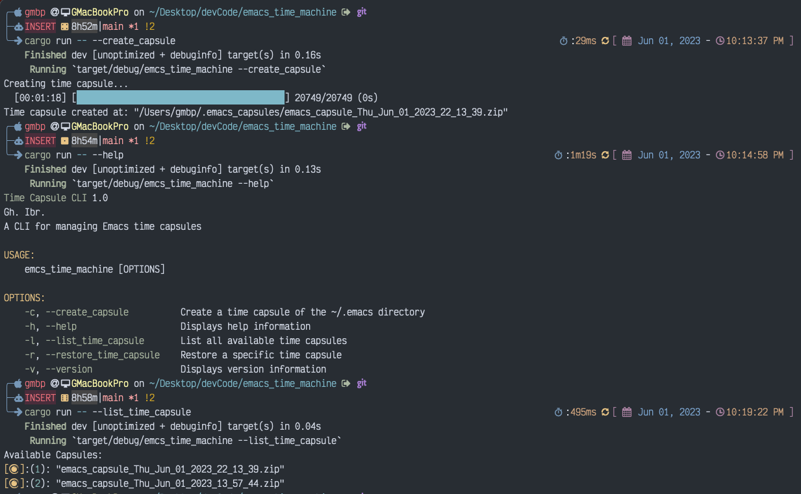

# Emacs Time Capsules
The following `CLI` is based on a `binary` built by `Cargo`. The purpose is to
keep a time snapshot of my current configurations directory of the `Emacs` in
the home directory in case of some new updates or experiments breaks the main
workflow of my `Spacemacs`. The binary runs on `arm64` cpu of my machine, but
can be rebuilt for any `OSX` system.

## Changelog
- [x] `2023-06-01 22:28`: Major functionality has been done and ready to be utilized.
---




## To do
- [x] Prevent to panic when there is not `.emacs.d` for first run
- [x] Add also the `spacemacs` file to the zip file and extract it also in the
given `home` directory.
- [ ] Adding using `termion` a selection based menu in terminal `TUI base`.
- [ ] Modularity for the repo structure.
- [ ] Update `clap` to use latest version.

## See all options
```bash
cargo run -- --help
Time Capsule CLI 1.0
Gh. Ibr.
A CLI for managing Emacs time capsules

USAGE:
    emcs_time_machine [OPTIONS]

OPTIONS:
    -c, --create_capsule          Create a time capsule of the ~/.emacs directory
    -h, --help                    Displays help information
    -l, --list_time_capsule       List all available time capsules
    -r, --restore_time_capsule    Restore a specific time capsule
    -v, --version                 Displays version information
```

## Create your capsules
Create a snapshot using:

```bash
cargo run -- --create_capsule
```

## Restore your capsule
For the list of current selected capsules, select the one to be recovered.

```bash
cargo run -- --restore_capsule
```

- Some binaries will need permission to be built with `Emacs` such as
`epdfinfo` binary which is based on `pdf-tools`. Just run,

```bash
chmod +x ~/.emacs.d/elpa/28.2/develop/pdf-tools-20230404.327/epdfinfo
```


